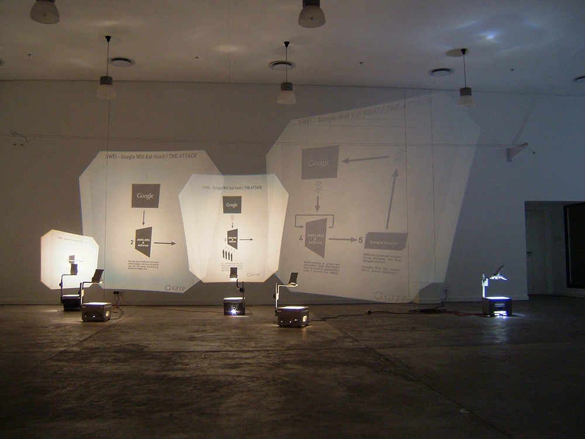

# Journal de création

## Semaine 9
> Contenu personnalisé à remplir par les équipes à chaque semaine faisant part du processus de création: résumé des réalisations d'équipe effectuées et des défis rencontrés sous forme d'un texte; ajout de vidéos, images, documents audios ou de contenu multimédia.)

Cette semaine a été parsemée de défis.

Tout d’abord, comme prévu, nous avons terminé de créer nos images dans Photoshop et le contenu 3D dans Maya. Nous avons également avancé la programmation multimédia du projet dans le logiciel Max et Unity.

Par la suite, nous avions prévu une séance d’enregistrement audio dans les studios de son. Cependant, misère (!), une panne d’électricité a eu lieu durant notre séance! Nous avons donc dû remettre celle-ci à quelques jours plus tard. (Nous avons beaucoup ri de cette situation.)

Enfin, nous venons de commencer à mettre en espace le projet dans le grand studio du collège. Nos projecteurs viennent tout juste d’être installés! 

On a bien hâte de voir le projet se concrétiser davantage dans les lieux physiques. À suivre

## Semaine 8

## Semaine 7

## Semaine 6

## Semaine 5

## Semaine 4

## Semaine 3

## Semaine 2

## Semaine 1

> Cette semaine, nous avons repensé au concept de notre projet d'interactivité. Nous avons grandement modifié notre concept principal, notament la partie en lien avec l'interactivité.

Tout d'abord, nous avons commencé à modifier la préproduction.

Nous avons aussi fait les scénarimages en lien avec l'installation

