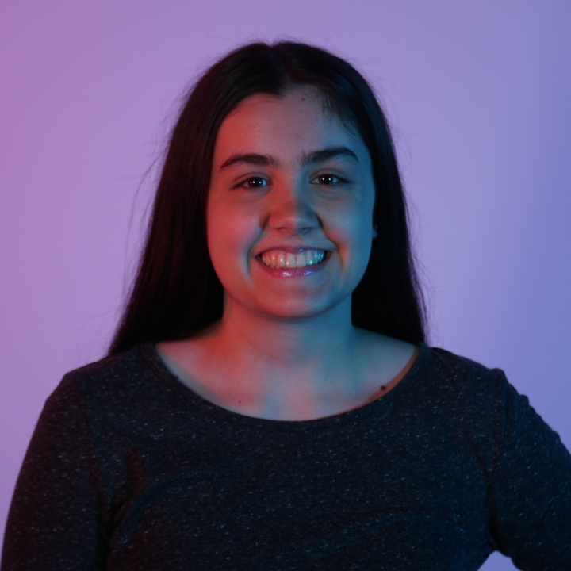

# Journal de Florence Lapierre

* [Semaine 1](#semaine-1)
* [Semaine 2](#semaine-2)
* [Semaine 3](#semaine-3)
* [Semaine 4](#semaine-4)
* [Semaine 5](#semaine-5)
* [Semaine de rattrapage](#semaine-de-rattrapage)
* [Semaine 6](#semaine-6)
* [Semaine 7](#semaine-7)
* [Semaine 8](#semaine-8)
* [Semaine 9](#semaine-9)

## Semaine 1

### Résumé des réalisations effectuées
- Recherche de matériel manquant (trépied à tablette, affiche)
- Moodboard de notre site web intéractif
- Budget de notre projet
- Contraintes techniques et potentiels problèmes de production
- Maquette du site web

### Image d'une réalisation dont tu es la ou le plus fier

### Est-ce que j'ai accompli l'ensemble des tâches et objectifs que je m'étais fixés pour cette semaine?	
- [x] Complètement
- [ ] Assez
- [ ] Peu
- [ ] Pas du tout

#### Décrivez pourquoi.
Oui, j'ai accompli l'ensemble de mes tâches pour cette semaine. Pour mes objectifs, je me suis fixé d'avancer en majeure partie notre préproduction et je l'ai accomplie.

#### S'il y a lieu, qu'allez-vous faire pour remédier à la situation?

### Mon projet s'est-il réalisé selon l’échéancier prévu?

- [ ] Complètement
- [x] Assez
- [ ] Un peu
- [ ] Pas tout à fait

#### S'il y a des écarts, décrivez-les.
La préproduction n'est pas terminée, car on n'a dû recommencer une bonne partie, à cause de changement majeur de notre concept.

#### S'il y a lieu, qu'allez-vous faire pour remédier à la situation?
Mon équipe et moi allons travailler plus fort pour remettre notre préproduction à temps.

#### Défis pour la prochaine semaine.
 Le défi pour la semaine prochaine est de finaliser la préproduction et de faire la vidéo à temps pour mardi.
    
---
## Semaine 2
### Résumé des réalisations effectuées
- Programmation de l'HTML du Site Web
- Programmation du Css en SASS du Site Web
- Programmation du Javascript du Site Web
- Montage vidéo de la vidiéo de la Préproduction
- Recherche sur les WebSockets et nodejs

### Image d'une réalisation dont tu es la ou le plus fier

### Est-ce que j'ai accompli l'ensemble des tâches et objectifs que je m'étais fixés pour cette semaine?

- [ ] Complètement
- [x] Assez
- [ ] Peu
- [ ] Pas du tout

#### Décrivez pourquoi.
Je me suis beaucoup avancée dans le site web cette semaine. J’ai aussi fait de la recherche sur le websocket et la librairie nodejs à utiliser. Mais je vais continuer à me renseigner sur la communication entre le site web et max.

#### S'il y a lieu, qu'allez-vous faire pour remédier à la situation?

### Mon projet s'est-il réalisé selon l’échéancier prévu?

- [ ] Complètement
- [x] Assez
- [ ] Un peu
- [ ] Pas tout à fait

#### S'il y a des écarts, décrivez-les.
Oui pour le site web. Mais pour la communication entre le site web et Max il me reste encore à faire de la recherche sur le sujet.

#### S'il y a lieu, qu'allez-vous faire pour remédier à la situation?
Je vais consacrer plus de temps à cette tâche.

### Défis pour la prochaine semaine

---
## Semaine 3 
### Résumé des réalisations effectuées
- Recherche sur la connexion WebSocket et Max
- Avancement du css et JavaScript du Site Web
- Commencer la connexion WebSocket avec le Site Web
- Accrocher les draps blancs au rideau et les steamers

### Image d'une réalisation dont tu es la ou le plus fier

### Est-ce que j'ai accompli l'ensemble des tâches et objectifs que je m'étais fixés pour cette semaine?

- [ ] Complètement
- [x] Assez
- [ ] Peu
- [ ] Pas du tout

#### Décrivez pourquoi.
Je me suis beaucoup avancé dans le site web et j’ai effectué des recherches concluantes sur les Websockets. Donc, j'ai pu m'avancer sur l'insertion du Websockets au Site Web.

#### S'il y a lieu, qu'allez-vous faire pour remédier à la situation?

### Mon projet s'est-il réalisé selon l’échéancier prévu?

- [ ] Complètement
- [x] Assez
- [ ] Un peu
- [ ] Pas tout à fait

#### S'il y a des écarts, décrivez-les.

Je n’ai pas réussi à intégrer complètement les Websocket au Site Web.

#### S'il y a lieu, qu'allez-vous faire pour remédier à la situation?

### Défis pour la prochaine semaine

Mon défi pour la semaine prochaine est de finir l'insertion du Websockets au Site Web et d'avoir fait des test avec les projections.
 
---
## Semaine 4
### Résumé des réalisations effectuées
- Accrocher les projecteurs et les haut-parleurs.
- Faite fonctionner les websockets sur le site Web.
- Commencer l’interactivité du site Web avec max.

### Image d'une réalisation dont tu es la ou le plus fier

### Est-ce que j'ai accompli l'ensemble des tâches et objectifs que je m'étais fixés pour cette semaine?

- [ ] Complètement
- [x] Assez
- [ ] Peu
- [ ] Pas du tout

#### Décrivez pourquoi.

J’ai réussi à faire fonctionner les websockets avec le Site Web. J’ai aussi accroché les haut-parleurs et les projecteurs, donc j’ai accompli toutes mes tâches pour cette semaine.
 
#### S'il y a lieu, qu'allez-vous faire pour remédier à la situation?

### Mon projet s'est-il réalisé selon l’échéancier prévu?

- [x] Complètement
- [ ] Assez
- [ ] Un peu
- [ ] Pas tout à fait

#### S'il y a des écarts, décrivez-les.

#### S'il y a lieu, qu'allez-vous faire pour remédier à la situation?

### Défis pour la prochaine semaine

Mon défi pour la semaine prochaine est de faire fonctionner le déclenchement des animations avec le Site Web.

---
## Semaine 5
### Résumé des réalisations effectuées
- Mapper les projections vidéo.
- Déclencher les animations dans Max
- Finition du style des modales (page personnelle des animaux du site web)

### Image d'une réalisation dont tu es la ou le plus fier

### Est-ce que j'ai accompli l'ensemble des tâches et objectifs que je m'étais fixés pour cette semaine?

- [ ] Complètement
- [x] Assez
- [ ] Peu
- [ ] Pas du tout

#### Décrivez pourquoi.
 J’ai finalisé une bonne partie du style des pages individuelles du site. J’ai aussi avancé le patcher max permettant de faire l’interactivité des animations. J’ai aussi commencé à faire le mapping vidéo.

#### S'il y a lieu, qu'allez-vous faire pour remédier à la situation?

### Mon projet s'est-il réalisé selon l’échéancier prévu?

- [ ] Complètement
- [x] Assez
- [ ] Un peu
- [ ] Pas tout à fait

#### S'il y a des écarts, décrivez-les.

#### S'il y a lieu, qu'allez-vous faire pour remédier à la situation?

### Défis pour la prochaine semaine
Mon défi pour la semaine prochaine est d’intégrer la détection de présence avec la kinect à notre projet.

---
## Semaine de rattrapage
### Résumé des réalisations effectuées
- Installation de la lumière et de sa programmation dans Max
- Ajout des images finales sur le Site Web et des sprites sheets.
- Programmation dans Max pour le déclenchement des bruitages et ambiances sonores.

### Image d'une réalisation dont tu es la ou le plus fier

### Est-ce que j'ai accompli l'ensemble des tâches et objectifs que je m'étais fixés pour cette semaine?

- [ ] Complètement
- [x] Assez
- [ ] Peu
- [ ] Pas du tout

#### Décrivez pourquoi.
 

#### S'il y a lieu, qu'allez-vous faire pour remédier à la situation?

### Mon projet s'est-il réalisé selon l’échéancier prévu?

- [ ] Complètement
- [x] Assez
- [ ] Un peu
- [ ] Pas tout à fait

#### S'il y a des écarts, décrivez-les.

#### S'il y a lieu, qu'allez-vous faire pour remédier à la situation?

### Défis pour la prochaine semaine

Mon défi pour la semaine prochaine est que la lumière soit déclenchée par la présence d'une personne. Aussi, que le style du Site Web soit terminé.

---
## Semaine 6
### Résumé des réalisations effectuées
- Finition du style du Site Web
- Finition du déclenchement de la lumière avec la détection de présence

### Image d'une réalisation dont tu es la ou le plus fier

### Est-ce que j'ai accompli l'ensemble des tâches et objectifs que je m'étais fixés pour cette semaine?

- [x] Complètement
- [ ] Assez
- [ ] Peu
- [ ] Pas du tout

#### Décrivez pourquoi.
 

#### S'il y a lieu, qu'allez-vous faire pour remédier à la situation?

### Mon projet s'est-il réalisé selon l’échéancier prévu?

- [ ] Complètement
- [x] Assez
- [ ] Un peu
- [ ] Pas tout à fait

#### S'il y a des écarts, décrivez-les.

#### S'il y a lieu, qu'allez-vous faire pour remédier à la situation?

### Défis pour la prochaine semaine

Finition des derniers détails du projet.

---
## Semaine 7
### Résumé des réalisations effectuées

- Enlever la barre d'onglet sur le site web.
- Bien rouler les fils au plafond et nettoyer pour la présentation du projet.

### Image d'une réalisation dont tu es la ou le plus fier

 
 

### Est-ce que j'ai accompli l'ensemble des tâches et objectifs que je m'étais fixés pour cette semaine?

- [x] Complètement
- [ ] Assez
- [ ] Peu
- [ ] Pas du tout

#### Décrivez pourquoi.

 Oui j'ai finis mes tâches de cette semaine, j'ai faite le site web et j'ai aider à faire le netoyage du petit studio pour la présentation de la semaine prochaine.

#### S'il y a lieu, qu'allez-vous faire pour remédier à la situation?

### Mon projet s'est-il réalisé selon l’échéancier prévu?

- [x] Complètement
- [ ] Assez
- [ ] Un peu
- [ ] Pas tout à fait

#### S'il y a des écarts, décrivez-les.

#### S'il y a lieu, qu'allez-vous faire pour remédier à la situation?

### Défis pour la prochaine semaine

Finaliser tout les petits détails du projet pour la présentation.

## Semaine 8

## Semaine 9
