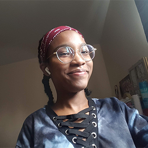

# Journal de Tracy Gua

* [Semaine 1](#semaine-1)
* [Semaine 2](#semaine-2)
* [Semaine 3](#semaine-3)
* [Semaine 4](#semaine-4)
* [Semaine 5](#semaine-5)
* [Semaine de rattrapage](#semaine-de-rattrapage)
* [Semaine 6](#semaine-6)
* [Semaine 7](#semaine-7)
* [Semaine 8](#semaine-8)
* [Semaine 9](#semaine-9)

## Semaine 1

### Résumé des réalisations effectuées
- Scénarimages pour les 6 animations principales
- Scénarimage de l'expérience intéractive
- Rechercher les équipements qui seront nécessaires
- Rechercher les logiciels qui seront utilisés

### Image d'une réalisation dont tu es la ou le plus fier

### Est-ce que j'ai accompli l'ensemble des tâches et objectifs que je m'étais fixés pour cette semaine?	
- [x] Complètement
- [ ] Assez
- [ ] Peu
- [ ] Pas du tout

#### Décrivez pourquoi.
J'ai accompli l'ensemble les tâches qui m'étaient attribuées et je suis satisfaite du résultat.

### Mon projet s'est-il réalisé selon l’échéancier prévu?

- [ ] Complètement
- [x] Assez
- [ ] Un peu
- [ ] Pas tout à fait

### Défis pour la prochaine semaine
Mon défi pour la semaine prochaine est de terminer la préproduction avant vendredi.

---
## Semaine 2
### Résumé des réalisations effectuées
- Terminer la préproduction.
- Filmer la vidéo de présentation du projet.
- Éditer la vidéo de présentation du projet.
- Commencer à faire des tests dans After Effects.

### Image d'une réalisation dont tu es la ou le plus fier

### Est-ce que j'ai accompli l'ensemble des tâches et objectifs que je m'étais fixés pour cette semaine?

- [x] Complètement
- [ ] Assez
- [ ] Peu
- [ ] Pas du tout

#### Décrivez pourquoi.
Je pense avoir fait le plus possible au niveau de la préproduction et je suis satisfaite d'avoir pu commencer à me réapproprier After Effects.

### Mon projet s'est-il réalisé selon l’échéancier prévu?

- [ ] Complètement
- [x] Assez
- [ ] Un peu
- [ ] Pas tout à fait

#### S'il y a des écarts, décrivez-les.
J'aurais aimé être plus avancée dans la réalisation des animations, car je risque de manquer de temps.

#### S'il y a lieu, qu'allez-vous faire pour remédier à la situation?
Je vais mieux organiser mon emploi du temps.

### Défis pour la prochaine semaine
Pour la semaine prochaine, il faudra beaucoup avancer la réalisation du prototype, donc, mon défi sera de finir le plus d'animations possible afin de pouvoir tester leur projection dans le petit studio.

---
## Semaine 3 
### Résumé des réalisations effectuées
- Commencer à animer l'arrière-plan dans After Effects
- Commencer à installer le matériel dans le petit studio

### Image d'une réalisation dont tu es la ou le plus fier

### Est-ce que j'ai accompli l'ensemble des tâches et objectifs que je m'étais fixés pour cette semaine?

- [ ] Complètement
- [x] Assez
- [ ] Peu
- [ ] Pas du tout

#### Décrivez pourquoi.
Je n'ai pas atteint tous mes objectifs cette semaine, c'est-à-dire que j'aurais aimé faire plus d'animations, mais je suis quand même satisfaite de ce que j'ai réalisé.

#### S'il y a lieu, qu'allez-vous faire pour remédier à la situation?
Après avoir fait un test de projection dans le petit studio, je prévois avancer plus rapidement la réalisation des animations.

### Mon projet s'est-il réalisé selon l’échéancier prévu?

- [ ] Complètement
- [x] Assez
- [ ] Un peu
- [ ] Pas tout à fait

### Défis pour la prochaine semaine

La semaine prochaine, je vais devoir faire plus d'animations et apporter mon aide pour l'installation.

---
## Semaine 4
### Résumé des réalisations effectuées
- Installation des projecteurs
- Avancement des animations
- Travail sur l'interactivité entre Max et le site Web

### Image d'une réalisation dont tu es la ou le plus fier

### Est-ce que j'ai accompli l'ensemble des tâches et objectifs que je m'étais fixés pour cette semaine?

- [ ] Complètement
- [x] Assez
- [ ] Peu
- [ ] Pas du tout

#### Décrivez pourquoi.
 Je suis satisfaite d'avoir pu trouver des solutions au niveau du site Web, mais je ne pense pas avoir réalisé assez d'animations cette semaine.

#### S'il y a lieu, qu'allez-vous faire pour remédier à la situation?
Comme l'installation est prête pour faire des tests, j'aurais plus de temps pour me concentrer sur les animations et Madmapper.

### Mon projet s'est-il réalisé selon l’échéancier prévu?

- [ ] Complètement
- [x] Assez
- [ ] Un peu
- [ ] Pas tout à fait

### Défis pour la prochaine semaine

Pour la semaine prochaine, il va falloir travailler en équipe pour déclencher des sons et des projections avec Max et Madmapper. Je prévois aussi avancer les animations.

---
## Semaine 5
### Résumé des réalisations effectuées
- Finalisation du prototype interactif 
- Avancement des animations

### Image d'une réalisation dont tu es la ou le plus fier

### Est-ce que j'ai accompli l'ensemble des tâches et objectifs que je m'étais fixés pour cette semaine?

- [ ] Complètement
- [x] Assez
- [ ] Peu
- [ ] Pas du tout

#### Décrivez pourquoi.
Le but cette semaine était d'avoir un système interactif visuel et sonore, ce que nous avons réussi. J'ai 
aidé avec le patch Max et Madmapper, ce qui m'a laissé moins de temps de faire des animations.

#### S'il y a lieu, qu'allez-vous faire pour remédier à la situation?
La semaine prochaine, je prévois me concentrer entièrement sur le paufinement des animations. D'ailleurs, ce sera une semaine de création de contenu pour toute l'équipe.

### Mon projet s'est-il réalisé selon l’échéancier prévu?

- [x] Complètement
- [ ] Assez
- [ ] Un peu
- [ ] Pas tout à fait

### Défis pour la prochaine semaine
D'ici la fin de la semaine prochaine, il nous faudra une version complète de notre installation. Donc, mon défi personnel sera de terminer toutes les animations.

---
## Semaine de rattrapage
### Résumé des réalisations effectuées

### Image d'une réalisation dont tu es la ou le plus fier

### Est-ce que j'ai accompli l'ensemble des tâches et objectifs que je m'étais fixés pour cette semaine?

- [ ] Complètement
- [ ] Assez
- [ ] Peu
- [ ] Pas du tout

#### Décrivez pourquoi.
 

#### S'il y a lieu, qu'allez-vous faire pour remédier à la situation?

### Mon projet s'est-il réalisé selon l’échéancier prévu?

- [ ] Complètement
- [ ] Assez
- [ ] Un peu
- [ ] Pas tout à fait

#### S'il y a des écarts, décrivez-les.

#### S'il y a lieu, qu'allez-vous faire pour remédier à la situation?

### Défis pour la prochaine semaine

---
## Semaine 6
### Résumé des réalisations effectuées

### Image d'une réalisation dont tu es la ou le plus fier

### Est-ce que j'ai accompli l'ensemble des tâches et objectifs que je m'étais fixés pour cette semaine?

- [ ] Complètement
- [ ] Assez
- [ ] Peu
- [ ] Pas du tout

#### Décrivez pourquoi.
 

#### S'il y a lieu, qu'allez-vous faire pour remédier à la situation?

### Mon projet s'est-il réalisé selon l’échéancier prévu?

- [ ] Complètement
- [ ] Assez
- [ ] Un peu
- [ ] Pas tout à fait

#### S'il y a des écarts, décrivez-les.

#### S'il y a lieu, qu'allez-vous faire pour remédier à la situation?

### Défis pour la prochaine semaine

---
## Semaine 7
### Résumé des réalisations effectuées

### Image d'une réalisation dont tu es la ou le plus fier

### Est-ce que j'ai accompli l'ensemble des tâches et objectifs que je m'étais fixés pour cette semaine?

- [ ] Complètement
- [ ] Assez
- [ ] Peu
- [ ] Pas du tout

#### Décrivez pourquoi.
 

#### S'il y a lieu, qu'allez-vous faire pour remédier à la situation?

### Mon projet s'est-il réalisé selon l’échéancier prévu?

- [ ] Complètement
- [ ] Assez
- [ ] Un peu
- [ ] Pas tout à fait

#### S'il y a des écarts, décrivez-les.

#### S'il y a lieu, qu'allez-vous faire pour remédier à la situation?

### Défis pour la prochaine semaine

## Semaine 8

## Semaine 9
